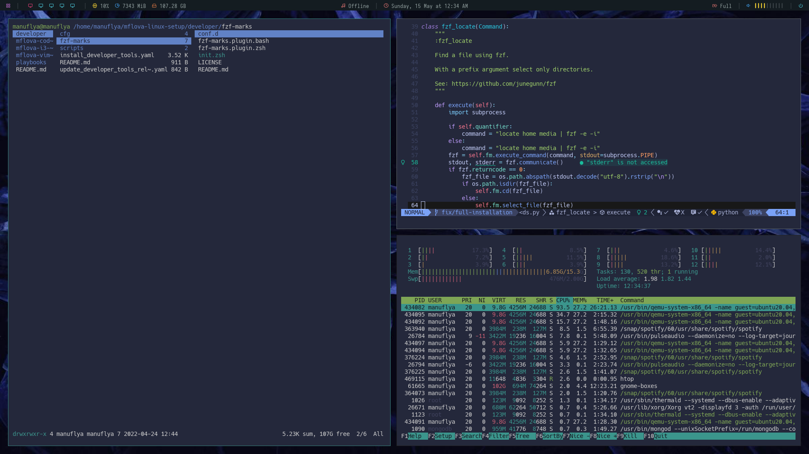
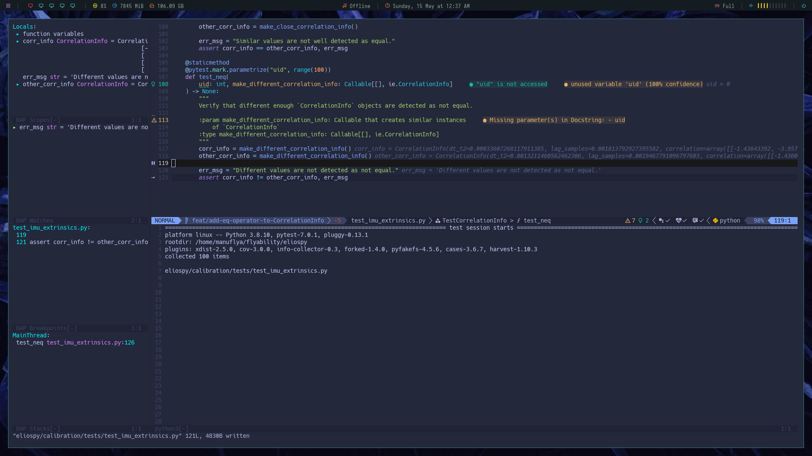

# Mflova setup

## General info

This repository is created to set up my personal and entire developer environment, which includes:

- Aliases
- Bashrc
- I3 Windows manager with wallpapers
- NerdFonts
- Terminal-based tools (ranger, fzf marks, fzf...)
- Neovim with fully integrate features (lsp, linters, testing mode, debugging mode,
  full git integration, markdown previwer...)

## Setup look

Main layout:



Example of Neovim debugger with lsp and linting:



## Installation

Tested on Ubuntu 20.04. From a fresh installed Ubntu, follow these steps and then some
of the instructiosn that might appear:

```shell
sudo apt-get update
sudo apt-get install git ansible
cd $HOME
git clone --recursive git@github.com:mflova/mflova-linux-setup.git
cd mflova-linux-setup
ansible-playbook --ask-become playbooks/1_install_developer_and_i3.yaml
ansible-playbook --ask-become playbooks/2_install_pre_nvim.yaml
ansible-playbook --ask-become playbooks/3_install_nvim.yaml
```

## Known issues or things to know

### Python version

By defaul, python 3.8 is installed. So far, it seems that the recommended way to upgrade it is just to install
`Python3.10` in a separate way and then setting up all the aliases in the `.bashrc`. While doing this, you
will probably have problems as `pip` will be quite outdated. You can update it with [this link](https://stackoverflow.com/questions/70431655/importerror-cannot-import-name-html5lib-from-pip-vendor-usr-lib-python3)
